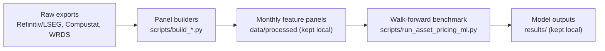

# European Asset Pricing with Machine Learning

Code for the MSc dissertation "Deep Learning and the Tradability Gradient in
European Equity Return Prediction".

Licensed raw data, processed panels, generated model outputs and submission
documents are not uploaded in Git due to license.

## Layout

```text
src/       Research modules and model implementations
scripts/   Command-line runners
tests/     Unit and regression tests
data/      Raw and processed data (kept local)
results/   Experiment outputs (kept local)
figures/   Generated figures (kept local)
```

## Pipeline



The analyst-estimates extension and the US comparison follow the same flow
with their own builder and runner commands; `docs/REPRODUCTION.md` lists all
of them.

Documentation:

- `DATA.md` describes the expected local data files and directories.
- `REFINITIV_ASSET_PRICING_DOWNLOAD_GUIDE.md` covers the Refinitiv/LSEG
  downloads.
- `docs/REPRODUCTION.md` lists the commands for the data builds and model runs.

## Setup

```bash
python -m venv .venv
source .venv/bin/activate
pip install -r requirements.txt
```

For LSEG/Refinitiv downloads, set credentials in your shell and keep them out
of the repository:

```bash
read -s LSEG_APP_KEY
export LSEG_APP_KEY
```

## Tests

The suite has 55 unit and regression test modules covering the panel builders,
model runners and portfolio construction.

```bash
pytest -q
```
